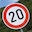

# Traffic Sign Classifier
[](http://www.udacity.com/drive)

[//]: # (Image References)

[img_train_samples]: ./images/r_train_samples.png "Training set samples"
[img_valid_test_samples]: ./images/r_valid_test_samples.png "Validation and testing set samples"
[img_train_distribution]: ./images/r_train_distribution.png "Training set distribution"
[img_valid_distribution]: ./images/r_valid_distribution.png "Validation set distribution"
[img_test_distribution]: ./images/r_test_distribution.png "Testing set distribution"
[img_preprocessing]: ./images/r_preprocessing.png "Preprocessing result"
[img_aug_distribution]: ./images/r_aug_distribution.png "Random image transformations"
[img_transformations]: ./images/r_transformations.png "Augmented dataset distribution"
[img_model]: ./images/model_architecture.png "Final model architecture"
[img_models]: ./images/models.png "Summary of architectures"
[img_conf_matrix]: ./images/r_confusion_matrix.png "Confusion Matrix"
[img_precision_recall]: ./images/r_precision_recall.png "Precision and Recall"
[img_LeNet]: ./images/LeNet_1.png "LeNet"
[img_LeNetMod]: ./images/LeNetMod_1.png "LeNetMod"
[img_VGGLikeNet]: ./images/VGGLikeNet_2.png "VGGLikeNet"
[img_VGGLikeNetV2]: ./images/VGGLikeNetV2_2.png "VGGLikeNetV2"
[img_VGGLikeNetV6]: ./images/VGGLikeNetV6_3.png "VGGLikeNetV6"
[img_VGGLikeNetV8]: ./images/VGGLikeNetV8_6.png "VGGLikeNetV8"
[img_VGGLikeNetV8_1]: ./images/VGGLikeNetV8_5.png "VGGLikeNetV8"
[img_VGGLikeNetV8_Final]: ./images/VGGLikeNetV8_8.png "Loss and accuracy"
[img_predictions]: ./images/r_predictions.png "Predictions on new images"
[img_top_k_1]: ./images/r_top_k_1.png "Top 5 probabilities"
[img_top_k_2]: ./images/r_top_k_2.png "Top 5 probabilities"
[img_top_k_3]: ./images/r_top_k_3.png "Top 5 probabilities"
[img_fmap_1]: ./images/r_fmap_1.png "Feature map for turn right ahead"
[img_fmap_2]: ./images/r_fmap_2.png "Feature map for speed limit 20km/h"
[img_fmap_3]: ./images/r_fmap_3.png "Feature map for stop"
[img_fmap_lenet_1]: ./images/r_fmap_lenet_1.png "Feature map on LeNET for turn right ahead"
[img_fmap_lenet_2]: ./images/r_fmap_lenet_2.png "Feature map on LeNET for speed limit 20km/h"
[img_fmap_lenet_3]: ./images/r_fmap_lenet_3.png "Feature map on LeNET for stop"
[img_fmap_no_sign]: ./images/r_fmap_no_sign.png "Feature map on an image with no traffic sign"
[img_top_k_no_sign]: ./images/r_top_k_no_sign.png "Top 5 probabilities on an image with no traffic sign"

![alt text][img_model]

Overview
---
In this project we will train and validate a model so it can classify traffic sign images using the [German Traffic Sign Dataset](http://benchmark.ini.rub.de/?section=gtsrb&subsection=dataset). After the model is trained, we then try it out on random images of traffic signs that can be found on the web.

The code is included in the [Traffic_Sign_Classifier jupyter notebook](Traffic_Sign_Classifier.ipynb) in this repository.

We use tensorflow to implement a convolutional neural network, the project consists of the following steps:

* Dataset exploration
* Preprocessing and model architecture and design
* Training and testing of the model
* Usage of the model to make predictions on new images
* Analysis of results on the new images
* Visual exploration of the model activations

The jupyter notebook also includes a discussion on various architectures and documentation of the testing process to reach the final result.

The final accuracy reached for the training, validation and testing datasets is as follows:

* Training accuracy: **1.0**
* Validation accuracy: **0.996**
* Testing accuracy: **0.992**

Requirements
---

Training the various models for many epochs requires a lot of computation and it's not feasible to use a CPU, if a NVIDIA GPU compatible with tensorflow is avaiable that's the way to go.

Alternatively AWS provides instance for GPU compute: personally I chose to use a p2.xlarge instance on EC2 (You'll have to ask for an increase in the [limits](https://console.aws.amazon.com/ec2/v2/home?region=us-west-2#Limits:) for this type of instance) that comes with an NVIDIA K80 GPUs and it's suited for training.

Also for this project I suggest to use the official [deep learning AMI](https://aws.amazon.com/marketplace/pp/B077GCH38C?ref=cns_srchrow) provided by Amazon that comes with all the necessary libraries already installed and relatively up to date (See https://docs.aws.amazon.com/dlami/latest/devguide/gs.html for more details about this AMI).

Once the instance is up and running you can connect and activate the tensorflow environment with python 3.6 typing:

```bash
source activate tensorflow_p36
```

You can now start a jupyter server in background:

```bash
nohup jupyter notebook &
```

Note that you have two options to use the jupyter notebook, either you open port 8888 for the instance (See [security groups](https://console.aws.amazon.com/ec2/v2/home?#SecurityGroups:sort=groupId) in the amazon console) or to avoid opening ports to the world you can use ssh forwarding when conneting to the instance as follows:

```bash
ssh -L 8888:localhost:8888 ec2-xx-xx-xx-xx.region.compute.amazonaws.com
```

Then from your browser open up http://localhost:8888

Data Set Summary & Exploration
---

The [German Traffic Sign Dataset](http://benchmark.ini.rub.de/?section=gtsrb&subsection=dataset) that is used in the project has the following properties (not that the dataset is already split in training/validation/test):

* The size of training set is 34799
* The size of the validation set is 4410
* The size of test set is 12630
* The shape of a traffic sign image is (32, 32, 3)
* The number of unique classes/labels in the data set is 43

We can start out having a look at the various images in the dataset to have an idea of what we are dealing with:

Some examples from the training, validation and testing datasets:

![alt text][img_train_samples]
![alt text][img_valid_test_samples]

Looking at the images we can notice that there is a brightness shift, this was crucial in order to decide later on on what pre-processing step to take.

We can continue plotting the distribution of the various datasets:

![alt text][img_train_distribution]

The ditribution of the images is not uniform and several contains very few examples, this may lead to poor perfomance on any model. At this point it is clear that data augmentation is required.

![alt text][img_valid_distribution]
![alt text][img_test_distribution]

We can notice that the distribution of the samples is the same among the various datasets, this is good news especially for the validation and test dataset that should be drawn from the same distribution.

Preprocessing
---

From the preliminatory explorations steps we can notice how the brightness of the images is shifted and several of them are very dark. We can proceed in trying to find out how to adjust this issue first. Using opencv we can add [historgram equalization]( https://docs.opencv.org/3.1.0/d5/daf/tutorial_py_histogram_equalization.html) and in particular we can use a technique called Contrast Limited Adaptive Histogram Equalization (CLAHE):

```python
import cv2

def equilize_hist():
    # Convert to LAB color space
    converted = cv2.cvtColor(img, cv2.COLOR_RGB2LAB)
    
    clahe = cv2.createCLAHE(clipLimit=2.0, tileGridSize=(4,4))

    # Equalize the histogram on the L channel only
    converted[:,:,0] = clahe.apply(converted[:,:,0])

    return cv2.cvtColor(converted, cv2.COLOR_LAB2RGB)
```

The following is a snapshot of the resulting images after preprocessing:

![alt text][img_preprocessing]

As part of the preprocessing step we can also normalized the images using min-max normalization:

```python
def normalize_data(X, a = -.5, b = .5, X_min = 0, X_max = 255):
    return a + ((X - X_min) * (b - a)) / (X_max - X_min)
```

Given the distribution of the dataset we can proceed augmenting the data, in particular we can notice that some of the images can be mirrored (at least horizontally), this is a cheap way to get more data:

```python
import numpy as np

def mirror_images(X, y):
    mirror_map = {
        11: 11,
        12: 12,
        13: 13,
        15: 15,
        17: 17,
        18: 18,
        19: 20,
        20: 19,
        22: 22,
        26: 26,
        30: 30,
        33: 34,
        34: 33,
        35: 35,
        36: 37,
        37: 36, 
        38: 39,
        39: 38
    }
    
    classes, count = np.unique(y, return_counts = True)
    
    mean = np.ceil(np.mean(count)).astype('uint32')
    
    additional_x = []
    additional_y = []
    
    for cls in tqdm(classes, unit=' classes', desc='Mirroring'):
        
        images_in_class = np.where(y == cls)[0]
        if cls in mirror_map:
            mirror_cls = mirror_map[cls]
            mirrored_h = X[images_in_class][:, :, ::-1, :]
            mirrored_h = mirrored_h[0:mean]
            additional_x.extend(mirrored_h)
            additional_y.extend(np.full((len(mirrored_h)), mirror_cls, dtype = int))

    additional_x = np.array(additional_x)
    additional_y = np.array(additional_y)
        
    X = np.concatenate((X, additional_x), axis = 0)
    y = np.concatenate((y, additional_y), axis = 0)
    
    return X, y
```

Note the map used for mirroring that define the source and the target after mirroring (e.g. some images after mirroring change the class, such as "keep left" -> "keep right").

We can now define some transformations to further augment the data:

```python
import cv2

def scale_image(img, x_factor=0.85, y_factor=0.85, border = 5):
    row_i, col_i, _ = img.shape
    
    img = cv2.resize(img, None, fx = x_factor, fy = y_factor)
    
    img = cv2.copyMakeBorder(img, border, border, border, border, cv2.BORDER_REPLICATE)
    
    row, col, _ = img.shape
    
    row_gap = round((row - row_i) / 2)
    col_gap = round((col - col_i) / 2)
    
    return img[row_gap:row_i + row_gap, col_gap:col_i + col_gap]

def translate_image(img, x = 5, y = 5, border = 5):
    img = cv2.copyMakeBorder(img, border, border, border, border, cv2.BORDER_REPLICATE)
    
    row, col, _ = img.shape

    trans_m = np.float32([[1, 0, x],[0, 1, y]])
    
    img = cv2.warpAffine(img, trans_m, (col, row))
    
    return img[border:row - border, border:col - border]

def transform_perspective(img, delta = [2, 2, 2, 2], border = 5):
    img = cv2.copyMakeBorder(img, border, border, border, border, cv2.BORDER_REPLICATE)
    
    row, col, _ = img.shape
    
    # Top left
    x1 = delta[0]
    y1 = delta[0]
    # Top right
    x2 = col - delta[1]
    y2 = delta[1]
    # Bottom left
    x3 = delta[2]
    y3 = row - delta[2]
    # Bottom right
    x4 = col - delta[3]
    y4 = row - delta[3]
    
    pts1 = np.float32([[x1, y1],[x2, y2],[x3, y3],[x4, y4]])
    pts2 = np.float32([[0, 0],[col, 0],[0, row],[col, row]])
    
    persp_m = cv2.getPerspectiveTransform(pts1,pts2)
    
    img = cv2.warpPerspective(img, persp_m , (row, col))
    
    return img[border:row - border, border:col - border]

def rotate_image(img, angle = 15, border = 5):
    img = cv2.copyMakeBorder(img, border, border, border, border, cv2.BORDER_REPLICATE)

    row, col, _ = img.shape

    rot_m = cv2.getRotationMatrix2D((row / 2, col / 2), angle, 1)

    img = cv2.warpAffine(img, rot_m, (col, row))
    
    return img[border:row - border, border:col - border]

def adjust_gamma(img, gamma = 1.0):
    invGamma = 1.0 / gamma
    
    gamma_m = np.array([((i / 255.0) ** invGamma) * 255 for i in np.arange(0, 256)]).astype("uint8")

    return cv2.LUT(img, gamma_m)
```

Some images after random transformations applied:

![alt text][img_transformations]

We can now generate new images using random transformations (stacking randomly different transformations together), this is the final distribution:

![alt text][img_aug_distribution]

In the image above we can see in orange the number of images generated due to mirroring only, and in blue the final distribution (all the classes are uniformely distributed).

After augmentation we can apply the preprocessing equalizing the histogram for all the images and applying normalization.

## Model Architecture

![alt text][img_model]

To be flexible during the experimentation we can define a class that allows us to build out model on top of tensorflow in a simple way, in the following we provide an implementation that includes *L2 regularization*, *batch normalization* and *dropout* after fully connected layers. This implementation uses gradient descent with *Adam* optimization as it seems to provide good results and the hope was that it would need less tweaking for batch size and the learning rate. For the loss we use *cross entropy* that for the given dataset is a good choice since it is designed to computed the probability error in discrete classification tasks when the classes are mutually exclusive.

```python
import time
import tensorflow as tf
from tensorflow.contrib.layers import flatten

MODEL_DIR = 'models'
MODEL_EXT = '.ckpt'

if not os.path.isdir(MODEL_DIR):
    os.makedirs(MODEL_DIR)

class ConvNet:
    
    def __init__(self, model_name, cfg, n_classes, l2_reg = False, batch_normalize = False):
        '''
        Builds a ConvNet with the given name and configuration.
        
        Input:
            - model_name: name of the model
            - cfg: The configuration of the model, an array of steps where each step is an array such as:
                   Convolution    : ('C', output_ch, filter_size, padding_type, max_pooling)
                   Fully Connected: ('F', output_size)
                   Logits         : ('L', output_size)

                   Note that for the convolution layer the max_pooling defines the parameter k, if omitted no
                   max pooling is applied
            - n_classes: Number of output classes
            - l2_reg: Boolean, true if l2 regularization should be enabled
            - batch_normalize: Boolean, true if batch normalization should be applied to the fully connected layers
        '''
        # Used in the weights inizialization
        self.mu = 0
        self.sigma = 0.1
        
        self.cfg = cfg
        self.l2_reg = l2_reg
        self.batch_normalize = batch_normalize
        self.model_name = model_name
        self.n_classes = n_classes
        self._init_placeholders()
        self.weights = []
        self.activations = []
        self.logits = self._build_model()
        self._init_operations()

    def _init_placeholders(self):
        self.features = tf.placeholder(tf.float32, (None, 32, 32, 3), name = 'features')
        self.labels = tf.placeholder(tf.int32, (None), name = 'labels')
        self.labels_encoded = tf.one_hot(self.labels, n_classes)
        self.learning_rate = tf.placeholder(tf.float32, name = 'learning_rate')
        self.keep_probability = tf.placeholder(tf.float32, name = 'keep_probability')
        # Decay and training phase for batch normalization
        self.bn_decay = tf.placeholder(tf.float32, name = 'bn_decay')
        self.is_training = tf.placeholder(tf.bool, name ='is_training')
        # Beta for L2 regularization
        self.l2_beta = tf.placeholder(tf.float32, name = 'l2_beta')
        
    def _init_operations(self):
        
        cross_entropy = tf.nn.softmax_cross_entropy_with_logits(labels = self.labels_encoded, logits = self.logits)
        self.loss = tf.reduce_mean(cross_entropy)
        
        regularizers = 0.0
        
        # L2 regularization
        if self.l2_reg:
            
            for weight in self.weights:
                regularizers += tf.nn.l2_loss(weight)
            
            self.loss = tf.reduce_mean(self.loss + self.l2_beta * regularizers)
        
        # Keeps track of the training steps
        self.global_step = tf.Variable(0)
        
        update_ops = tf.get_collection(tf.GraphKeys.UPDATE_OPS)
        
        # For batch normalization
        with tf.control_dependencies(update_ops):
            # Gradient descent with adam optimization
            self.optimizer = tf.train.AdamOptimizer(learning_rate = self.learning_rate).minimize(self.loss, global_step = self.global_step)
        
        self.prediction = tf.argmax(self.logits, 1)
        correct_prediction = tf.equal(self.prediction, tf.argmax(self.labels_encoded, 1))
        self.accuracy = tf.reduce_mean(tf.cast(correct_prediction, tf.float32))
        
    def _build_model(self):
        '''
        Builds the model from the configuration
        '''
        self.desc = []
        
        x = self.features
        
        for step in self.cfg:

            step_type  = step[0]
            
            input_shape = x.get_shape().as_list()
            
            input_size = input_shape[1] if len(input_shape) == 2 else input_shape[3]
            output_size = step[1]
            
            if step_type == 'C':
                
                filter_size = step[2]
                padding = step[3]
                
                w, b = self._weights_and_biases(input_size, output_size, filter_size)
                x = self._convolution_relu(x, w, b, padding = padding)
                
                self.weights.append(w)
                self.activations.append(x)
                
                desc = "Conv (Input: {}, {}@{}x{}, pad = {})".format(input_size, output_size, filter_size, filter_size, padding)
                
                if len(step) == 5:
                    x = self._max_pooling(x, k = step[4])
                    desc +=", Max Pooling ({})".format(step[4])
                
                self.desc.append(desc)
                
            elif step_type == 'F':
                
                if not len(input_shape) == 2:
                    x = flatten(x)
                    input_size = x.get_shape().as_list()[1]
                    
                w, b = self._weights_and_biases(input_size, output_size)
                
                x = self._fully_connected(x, w, b)
                
                self.weights.append(w)
                self.activations.append(x)
                
                x = tf.nn.dropout(x, keep_prob = self.keep_probability)
                
                self.desc.append("Fully Connected ({}x{}, Dropout)".format(input_size, output_size))
                
            elif step_type == 'L':
                
                w, b = self._weights_and_biases(input_size, output_size)              
                
                x = self._fully_connected(x, w, b, relu = False)
                
                self.weights.append(w)
                self.desc.append("Out ({}x{})".format(input_size, output_size))
                
        return x
        
    def _get_model_file(self, run_n):
        return os.path.join(MODEL_DIR, self.model_name + ('_' + str(run_n) if run_n > 0 else '') + MODEL_EXT)
    
    def _weights_and_biases(self, input_ch, output_ch, filter_size = None):
        shape = (input_ch, output_ch) if filter_size is None  else (filter_size, filter_size, input_ch, output_ch)

        w = tf.Variable(tf.truncated_normal(shape = shape, mean = self.mu, stddev = self.sigma))    
        b = tf.Variable(tf.zeros(output_ch))

        return w, b
    
    def _fully_connected(self, x, W, b, relu = True):
        x = tf.matmul(x, W)
        x = tf.nn.bias_add(x, b)
        if self.batch_normalize:
            # Unfortunately fused = True does not work with older version of tensorflow (e.g. 0.12.1)
            x = tf.contrib.layers.batch_norm(x, center = True, fused = False, decay = self.bn_decay, is_training = self.is_training)
        if relu:
            x = tf.nn.relu(x)
        return x

    def _convolution_relu(self, x, W, b, s = 1, padding = 'VALID'):
        x = tf.nn.conv2d(x, W, strides = [1, s, s, 1], padding = padding)
        x = tf.nn.bias_add(x, b)
        x = tf.nn.relu(x)
        return x

    def _max_pooling(self, x, k = 2, padding = 'VALID'):
        x = tf.nn.max_pool(x, ksize = [1, k, k, 1], strides = [1, k, k, 1], padding = padding)
        return x
    
    def summary(self):
        for step in self.desc:
            print(step)
        
    def train(self, params, restore = False):
        '''
        Runs the training on the model.
        
        Input:
            - params: A dictionary containing the hyper parameters for the training:
                run_n: The run number (e.g. number of experiment), used to save the model
                X: The train set input features
                y: The train set labels
                X_valid: The validation set input features
                y_valid: The validation set labels
                epochs: The number of epochs
                batch_size: The size of the mini batches
                learning_rate: The initial learning rate
                keep_probability: The probability (one-minus) for the dropout
                l2_beta: Beta for l2 regularization (if enabled)
                bn_decay: The decay for batch normalization (if enabled)
            - restore: Boolean, if true restores the model from the latest checkpoint
            
        Output:
            Training and validation log containing each an array of pairs (loss, accuracy) computed at each epoch
        '''
        # Unpack params
        run_n            = params['run_n']
        X                = params['X']
        y                = params['y']
        X_valid          = params['X_valid']
        y_valid          = params['y_valid']
        epochs           = params['epochs']
        batch_size       = params['batch_size']
        learn_rate       = params['learning_rate']
        keep_p           = params['keep_probability']
        l2_reg_beta      = params['l2_beta']
        batch_norm_decay = params['bn_decay']
        
        filepath         = self._get_model_file(run_n)

        # Used later on for plotting
        train_log = []
        valid_log = []

        saver = tf.train.Saver()

        with tf.Session() as sess:

            if restore:
                self.restore(params, sess)
            else:        
                sess.run(tf.global_variables_initializer())

            num_examples = len(X)

            print("Training {} #{}, {} samples (EP: {}, BS: {}, LR: {}, KP: {}, L2: {}, BN: {})...".format(
                self.model_name, run_n, num_examples, epochs, batch_size, learn_rate, keep_p,
                l2_reg_beta if self.l2_reg else 'OFF',
                batch_norm_decay if self.batch_normalize else 'OFF'
            ))
            print()

            start = time.time()

            for i in range(epochs):
                # Shuffle dataset on each epoch
                X, y = shuffle(X, y)

                start_ep = time.time()
                
                #offset_it = tqdm(range(0, num_examples, batch_size), unit = ' Batches', desc = 'EPOCH {}'.format(i + 1))
                
                for offset in range(0, num_examples, batch_size):
                    end = offset + batch_size

                    batch_x, batch_y = X[offset:end], y[offset:end]
                    
                    feed_dict = {
                        self.features: batch_x, 
                        self.labels: batch_y, 
                        self.learning_rate: learn_rate, 
                        self.keep_probability: keep_p,
                        self.l2_beta: l2_reg_beta,
                        self.bn_decay: batch_norm_decay,
                        self.is_training: True
                    }

                    _ = sess.run(self.optimizer, feed_dict = feed_dict)

                train_loss, train_acc = self.evaluate(X, y, params, sess)
                train_log.append([train_loss, train_acc])
                
                valid_loss, valid_acc = self.evaluate(X_valid, y_valid, params, sess)
                valid_log.append([valid_loss, valid_acc])

                elapsed_ep = time.time() - start_ep
                
                steps = sess.run(self.global_step)

                print("EPOCH {} ({:.1f} s, {}): Train Loss/Accuracy: ({:.4f}, {:.4f}) Validation Loss/Accuracy: ({:.4f}, {:.4f})".format(
                    i + 1, elapsed_ep, steps, train_loss, train_acc, valid_loss, valid_acc
                ))

            elapsed = time.time() - start
            print("Training finished ({:.1f} s)".format(elapsed))
            
            save_path = saver.save(sess, filepath)
            print("Model saved in path:", save_path)
            
            return np.array(train_log), np.array(valid_log)
        
    def restore(self, params, sess):
        '''
        Restores a model and returns a session
        '''
        saver = tf.train.Saver()
        run_n = params['run_n']
        saver.restore(sess, self._get_model_file(run_n))
        
    def evaluate(self, X, y, params, sess):
        '''
        Evaluates the model on the given dataset
        
        Input:
            - X: The input features
            - y: The labels
            - params: Dictionary containing the parameters for the model
                batch_size: The size of the minibatches
                l2_beta: Beta for l2 regularization (if enabled)
                bn_decay: The decay for batch normalization (if enabled)
        
        Output:
            (loss, accuracy) pair
        '''
        num_examples = len(X)
        
        batch_size       = params['batch_size']
        l2_reg_beta      = params['l2_beta']
        batch_norm_decay = params['bn_decay']
        
        total_loss = 0
        total_accuracy = 0
            
        for offset in range(0, num_examples, batch_size):

            batch_x, batch_y = X[offset:offset + batch_size], y[offset:offset + batch_size]

            feed_dict = {
                self.features: batch_x,
                self.labels: batch_y,
                self.keep_probability: 1,
                self.l2_beta: l2_reg_beta,
                self.bn_decay: batch_norm_decay,
                self.is_training: False
            }
            
            loss, accuracy = sess.run([self.loss, self.accuracy], feed_dict = feed_dict)

            total_loss += (loss * len(batch_x))
            total_accuracy += (accuracy * len(batch_x))

        return total_loss / num_examples, total_accuracy / num_examples
        
    def predict(self, X, params, sess):
        
        l2_reg_beta      = params['l2_beta']
        batch_norm_decay = params['bn_decay']
            
        feed_dict = {
            self.features: X,
            self.keep_probability: 1,
            self.l2_beta: l2_reg_beta,
            self.bn_decay: batch_norm_decay,
            self.is_training: False
        }
        
        prob, pred = sess.run([tf.nn.softmax(self.logits), self.prediction], feed_dict = feed_dict)
        
        return pred, prob
```

Note that on recent version of tensorflow you can enable the option ```fused``` when using batch normalization as it speeds up training.

Now we can define our model:

```python
def VGGLikeNet(l2_reg = False, batch_normalize = False):
    '''
    Input: 32x32x3
    -> Conv (3x3x32  pad = SAME)
    -> Conv (3x3x32  pad = SAME), MaxPooling
    -> Conv (3x3x64  pad = SAME)
    -> Conv (3x3x64  pad = SAME), MaxPooling
    -> Conv (3x3x128 pad = SAME)
    -> Conv (3x3x128 pad = SAME), MaxPooling, Flatten
    -> FC   (2048x512)          , Dropout
    -> FC   (256x43)
    '''
    cfg = [('C',  32, 3, 'SAME'),    # 32x32x32
           ('C',  32, 3, 'SAME', 2), # 16x16x32
           ('C',  64, 3, 'SAME'),    # 16x16x64
           ('C',  64, 3, 'SAME', 2), # 8x8x64
           ('C', 128, 3, 'SAME'),    # 8x8x128
           ('C', 128, 3, 'SAME', 2), # 4x4x128
           ('F', 512),
           ('L', n_classes)]
    
    return ConvNet('VGGLikeNet', cfg, n_classes, l2_reg = l2_reg, batch_normalize = batch_normalize)

model = VGGLikeNet(True, True)
model.summary()
```
```
Conv (Input: 3, 32@3x3, pad = SAME)
Conv (Input: 32, 32@3x3, pad = SAME), Max Pooling (2)
Conv (Input: 32, 64@3x3, pad = SAME)
Conv (Input: 64, 64@3x3, pad = SAME), Max Pooling (2)
Conv (Input: 64, 128@3x3, pad = SAME)
Conv (Input: 128, 128@3x3, pad = SAME), Max Pooling (2)
Fully Connected (2048x512, Dropout)
Out (512x43)
```

Training and Testing
---

We can define various experiments and train our model:

```python
def run_experiments(experiments):
    
    results = []
    
    for exp_params in experiments:

        if exp_params['skip']:
            continue

        exp_model = exp_params['model']

        exp_l2_reg = exp_params['l2_reg']
        exp_batch_normalize = exp_params['batch_normalize']

        tf.reset_default_graph()

        exp_model = exp_model(l2_reg = exp_l2_reg, batch_normalize = exp_batch_normalize)

        # Train the model
        exp_train_log, exp_valid_log = exp_model.train(exp_params)
        
        # Evaluate
        with tf.Session() as sess:
            exp_model.restore(exp_params, sess)
            exp_test_loss, exp_test_acc = exp_model.evaluate(X_test_final, y_test_final, exp_params, sess)

            results.append([exp_model, exp_train_log, exp_valid_log, exp_test_loss, exp_test_acc])

            plot_results(exp_model, exp_params, exp_train_log, exp_valid_log, exp_test_loss, exp_test_acc)
    
    return results
```

As an example I used the following parameters to train the model:

* Epochs: 50
* Batch size: 128
* Learning rate: 0.00025
* Dropout probability (Fully connected): 0.5
* L2 Beta: 0.0001
* Batch Norm Decay: 0.9

```python
experiments = [
    {
        'run_n'           : 1,
        'model'           : VGGLikeNet,
        'l2_reg'          : True,
        'batch_normalize' : True,
        'X'               : X_train_final,
        'y'               : y_train_final,
        'X_valid'         : X_valid_final,
        'y_valid'         : y_valid_final,
        'epochs'          : 50,
        'batch_size'      : 128,
        'learning_rate'   : 0.00025,
        'keep_probability': 0.5,
        'l2_beta'         : 0.0001,
        'bn_decay'        : 0.9,
        'skip'            : False
    }
]

run_experiments(experiments)
```

![alt text][img_VGGLikeNetV8_Final]

Testing the model on new images
---

We can download from the web various german traffic signs (The images are in this repository in the [test_images](test_images) folder):




All the images have been cropped to 32x32, we can see that there are some variations with some noise in certain imageas and some rotations/distorsions. We can now run some predictions :)

```python
X_ext_processed, y_ext_processed = preprocess_data(X_ext, y_ext, shuffle_data = False)

tf.reset_default_graph()
final_model = final_params['model'](final_params['l2_beta'], final_params['bn_decay'])

def compute_predictions(model, params, X):
    
    with tf.Session() as sess:
        model.restore(params, sess)
        pred, prob = model.predict(X, params, sess)
        return pred, prob

pred, prob = compute_predictions(final_model, final_params, X_ext_processed)
```

![alt text][img_predictions]

We can also compute the top k probabilities of the model and see how confident it is in the predictions:

```python
def compute_top_k(prob):
    with tf.Session() as sess:
        return sess.run(tf.nn.top_k(prob, k = 5))
```

![alt text][img_top_k_3]

Finally we can visualize the feature maps on our model:

```python
def outputFeatureMap(sess, tf_activation, feed_dict, activation_min=-1, activation_max=-1 ,plt_num=1):
    activation = tf_activation.eval(session=sess, feed_dict=feed_dict)
    featuremaps = activation.shape[3]
    plt.figure(plt_num, figsize=(15,15))
    for featuremap in range(featuremaps):
        plt.subplot(6,8, featuremap+1) # sets the number of feature maps to show on each row and column
        plt.title('FeatureMap ' + str(featuremap)) # displays the feature map number
        if activation_min != -1 & activation_max != -1:
            plt.imshow(activation[0,:,:, featuremap], interpolation="nearest", vmin =activation_min, vmax=activation_max, cmap="gray")
        elif activation_max != -1:
            plt.imshow(activation[0,:,:, featuremap], interpolation="nearest", vmax=activation_max, cmap="gray")
        elif activation_min !=-1:
            plt.imshow(activation[0,:,:, featuremap], interpolation="nearest", vmin=activation_min, cmap="gray")
        else:
            plt.imshow(activation[0,:,:, featuremap], interpolation="nearest", cmap="gray")

def visualize_fmap(params, images, layers = 3, max_f_maps = 8):

    tf.reset_default_graph()
    model = params['model'](l2_reg = params['l2_reg'], batch_normalize = params['batch_normalize'])
    
    with tf.Session() as sess:
        
        model.restore(params, sess)

        for img, label in images:
            if label is not None:
                print(labels_map[label][1])
            else:
                print('No label')
            feed_dict = {
                model.features: [img],
                model.keep_probability: 1,
                model.l2_beta: params['l2_beta'],
                model.bn_decay: params['bn_decay'],
                model.is_training: False
            }

            for i, a in enumerate(model.activations[:layers]):
                outputFeatureMap(sess, a[:, :, :, :max_f_maps], feed_dict, activation_min=-1, activation_max=-1 , plt_num=i+1)
                
            plt.show()
            
visualize_fmap(final_params, [(X_ext_processed[1], y_ext_processed[1])])
```

![alt text][img_fmap_1]

We can see that the model seems to capture the more relevant features of the image such as the border of the sign and the constrast of the drawing inside the sign even when rotated (e.g. the 20km/h limit sign).
