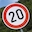
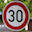
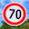
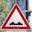
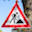

# **Traffic Sign Recognition** 

In this project we built a convolutional neural network using tensorflow with the goal to classify traffic signs from images. The model was trained using the [German Traffic Sign Dataset](http://benchmark.ini.rub.de/?section=gtsrb&subsection=dataset).

The project consisted of the following steps:

* Dataset exploration
* Preprocessing and model architecture and design
* Training and testing of the model
* Usage of the model to make predictions on new images
* Analysis of results on the new images
* Visual exploration of the model activations

[//]: # (Image References)

[img_train_samples]: ./images/r_train_samples.png "Training set samples"
[img_valid_test_samples]: ./images/r_valid_test_samples.png "Validation and testing set samples"
[img_train_distribution]: ./images/r_train_distribution.png "Training set distribution"
[img_valid_distribution]: ./images/r_valid_distribution.png "Validation set distribution"
[img_test_distribution]: ./images/r_test_distribution.png "Testing set distribution"
[img_preprocessing]: ./images/r_preprocessing.png "Preprocessing result"
[img_aug_distribution]: ./images/r_aug_distribution.png "Random image transformations"
[img_transformations]: ./images/r_transformations.png "Augmented dataset distribution"
[img_model]: ./images/model_architecture.png "Final model architecture"
[img_models]: ./images/models.png "Summary of architectures"
[img_conf_matrix]: ./images/r_confusion_matrix.png "Confusion Matrix"
[img_precision_recall]: ./images/r_precision_recall.png "Precision and Recall"
[img_LeNet]: ./images/LeNet_1.png "LeNet"
[img_LeNetMod]: ./images/LeNetMod_1.png "LeNetMod"
[img_VGGLikeNet]: ./images/VGGLikeNet_2.png "VGGLikeNet"
[img_VGGLikeNetV2]: ./images/VGGLikeNetV2_2.png "VGGLikeNetV2"
[img_VGGLikeNetV6]: ./images/VGGLikeNetV6_3.png "VGGLikeNetV6"
[img_VGGLikeNetV8]: ./images/VGGLikeNetV8_6.png "VGGLikeNetV8"
[img_VGGLikeNetV8_1]: ./images/VGGLikeNetV8_5.png "VGGLikeNetV8"
[img_VGGLikeNetV8_Final]: ./images/VGGLikeNetV8_8.png "Loss and accuracy"
[img_predictions]: ./images/r_predictions.png "Predictions on new images"
[img_top_k_1]: ./images/r_top_k_1.png "Top 5 probabilities"
[img_top_k_2]: ./images/r_top_k_2.png "Top 5 probabilities"
[img_top_k_3]: ./images/r_top_k_3.png "Top 5 probabilities"
[img_fmap_1]: ./images/r_fmap_1.png "Feature map for turn right ahead"
[img_fmap_2]: ./images/r_fmap_2.png "Feature map for speed limit 20km/h"
[img_fmap_3]: ./images/r_fmap_3.png "Feature map for stop"
[img_fmap_lenet_1]: ./images/r_fmap_lenet_1.png "Feature map on LeNET for turn right ahead"
[img_fmap_lenet_2]: ./images/r_fmap_lenet_2.png "Feature map on LeNET for speed limit 20km/h"
[img_fmap_lenet_3]: ./images/r_fmap_lenet_3.png "Feature map on LeNET for stop"
[img_fmap_no_sign]: ./images/r_fmap_no_sign.png "Feature map on an image with no traffic sign"
[img_top_k_no_sign]: ./images/r_top_k_no_sign.png "Top 5 probabilities on an image with no traffic sign"

## Rubric Points
### Here I will consider the [rubric points](https://review.udacity.com/#!/rubrics/481/view) individually and describe how I addressed each point in my implementation.  

---
### Writeup / README

#### 1. Provide a Writeup / README that includes all the rubric points and how you addressed each one. You can submit your writeup as markdown or pdf. You can use this template as a guide for writing the report. The submission includes the project code.

You're reading it! and here is a link to my [project code](https://github.com/marcomarasca/CarND-Traffic-Sign-Classifier)

### Data Set Summary & Exploration

#### 1. Provide a basic summary of the data set. In the code, the analysis should be done using python, numpy and/or pandas methods rather than hardcoding results manually.

I used numpy to calculate summary statistics of the traffic signs data set:

* The size of training set is 34799
* The size of the validation set is 4410
* The size of test set is 12630
* The shape of a traffic sign image is (32, 32, 3)
* The number of unique classes/labels in the data set is 43

#### 2. Include an exploratory visualization of the dataset.

I started out having a look at the various images in the dataset to have an idea of what I was dealing with:

Some examples from the training, validation and testing datasets:

![alt text][img_train_samples]
![alt text][img_valid_test_samples]

Looking at the images we can notice that there is a brightness shift, this was crucial in order to decide later on on what pre-processing step to take.

I continued plotting the distribution of the various datasets:

![alt text][img_train_distribution]

The ditribution of the images is not uniform and several contains very few examples, this may lead to poor perfomance on any model. At this point it was clear that data augmentation was required.

![alt text][img_valid_distribution]
![alt text][img_test_distribution]

We can notice that the distribution of the samples is the same among the various datasets, this is good news especially for the validation and test dataset that should be drawn from the same distribution.

### Design and Test a Model Architecture

#### 1. Describe how you preprocessed the image data. What techniques were chosen and why did you choose these techniques? Consider including images showing the output of each preprocessing technique. Pre-processing refers to techniques such as converting to grayscale, normalization, etc. (OPTIONAL: As described in the "Stand Out Suggestions" part of the rubric, if you generated additional data for training, describe why you decided to generate additional data, how you generated the data, and provide example images of the additional data. Then describe the characteristics of the augmented training set like number of images in the set, number of images for each class, etc.)

From the preliminatory explorations steps I could notice how the brightness of the images was shifted and several of them were very dark. I therefore proceeded in trying to find out how to adjust this issue first. Using opencv we can add [historgram equalization]( https://docs.opencv.org/3.1.0/d5/daf/tutorial_py_histogram_equalization.html) and in particular I used a technique called Contrast Limited Adaptive Histogram Equalization (CLAHE). Already at this point I started the first experiments with a simple model based on the LeNet architecture to see what was giving me better results. Note that the histrogram equalization was applied after converting the images to the LAB color space and applying the equalization only on the L(ightness) channel so that I could fix only the brightness.

The following is a snapshot of the resulting images after preprocessing:

![alt text][img_preprocessing]

As part of the first preprocessing step I also normalized the images using min-max normalization. I tested various parameters and ended up chosing -0.5 and 0.5.

I then proceeded thinking about data augmentation, initially I introduced a few geometric transformation (rotation, translation, zoom) and augmented the training dataset of a relatively small factor ending up with about 3 times the number of images. I performed some preliminary testing on this dataset but decided to spend more time on having better augmentation.

I therefore added some other transformations as well as image mirroring. I used only a set of classes that could be mirrored only horizontally
taking care of the fact that some classes when mirrored may change class (e.g. keep right -> keep left).

After mirroring, the final augmentation techiques I used are as follow:

* Scaling
* Translation
* Perspective transformation
* Image rotation
* Gamma variation

![alt text][img_transformations]

I then generated random transformations from the above list (stacking randomly different transformations together) and ended up with the final augmented dataset:

![alt text][img_aug_distribution]

In the image above we can see in orange the number of images generated due to mirroring only, and in blue the final distribution (all the classes are uniformely distributed).

After augmentation I then applied the preprocessing equalizing the histogram for all the images and applying normalization.

#### 2. Describe what your final model architecture looks like including model type, layers, layer sizes, connectivity, etc.) Consider including a diagram and/or table describing the final model.

 After several hours of experimentation and fine tuning I decided to stick to a model that follows after the VGG architecture, having multiple convolutions with maxpooling and finally using a fully connected layer and dropout. While there are probably better model architectures out there (e.g. ResNet, inception etc) the VGG is very simple to implement and I added different pieces to improve the model peformance such as L2 regularization and batch normalization.

My final model consisted of the following layers:

| Layer         		|     Description	        					| 
|:---------------------:|:---------------------------------------------:| 
| Input         		| 32x32x3 RGB image   							| 
| Convolution 3x3     	| 1x1 stride, same padding, outputs 32x32x32 	|
| RELU					|
| Convolution 3x3     	| 1x1 stride, same padding, outputs 32x32x32 	|
| RELU					|												|
| Max pooling	      	| 2x2 stride,  outputs 16x16x32 				|
| Convolution 3x3     	| 1x1 stride, same padding, outputs 16x16x64 	|
| RELU					|
| Convolution 3x3     	| 1x1 stride, same padding, outputs 16x16x64 	|
| RELU					|												|
| Max pooling	      	| 2x2 stride,  outputs 8x8x64   				|
| Convolution 3x3     	| 1x1 stride, same padding, outputs 8x8x128 	|
| RELU					|
| Convolution 3x3     	| 1x1 stride, same padding, outputs 8x8x128 	|
| RELU					|												|
| Max pooling	      	| 2x2 stride,  outputs 4x4x128   				|
| Fully Connected       | outputs 2048x512              				|
| Dropout               |
| Logits                | outputs 512x43                 				|

In the following I provide a visual representation of the final model:

![alt text][img_model]

During the experimentation I tested out several different architectures, playing with the number and size of the layers. In particular I started from the LeNet based architecture and built on top of it. After reaching a limit in the accuracy achieved I decided to eperiment with deeper networks and switched to a VGG oriented architecture performing several experiments to find the best fitting layer architecture. I implemented an adapted version of VGG13 but found it was too slow with the resources at my disposal, so I removed one layer. Finally I implemented the final model removing one of the fully connected layers that proved to perform better.

The following table depicts a summary of the main architectures I focused on:

![alt text][img_models]
 
#### 3. Describe how you trained your model. The discussion can include the type of optimizer, the batch size, number of epochs and any hyperparameters such as learning rate.

I implemented a flexible class that allowed me to try out several different techniques for improving the final model. After the initial experimentation with the basic LeNet architecture I added *L2 regularization*, *batch normalization* and *dropout* for the fully connected layers. The model uses gradient descent with *Adam* optimization as it seems to provide good results and the hope was that it would need less tweaking for batch size and the learning rate. For the loss we use *cross entropy* that for the given dataset is a good choice since it is designed to computed the probability error in discrete classification tasks when the classes are mutually exclusive.

I had several hyperparamters to tune, in particular I started out with deciding on the *batch size* and *learning rate* using a few epochs in the beginning to get an idea of how it was going. Since I tried different architectures in parallel I had to perform several tests but ended up with a set of parameters that were working quite well. After introducing L2 regularization and batch normalization I also fine tuned the *L2 regularization beta* and the *batch normalization decay*.

The parameters I used for the final model (aside from the size and number of layers that I also considered as hyperparameters in my experiments) are as follows:

* Epochs: 50
* Batch size: 128
* Learning rate: 0.00025
* Dropout probability (Fully connected): 0.5
* L2 Beta: 0.0001
* Batch Norm Decay: 0.9

#### 4. Describe the approach taken for finding a solution and getting the validation set accuracy to be at least 0.93. Include in the discussion the results on the training, validation and test sets and where in the code these were calculated. Your approach may have been an iterative process, in which case, outline the steps you took to get to the final solution and why you chose those steps. Perhaps your solution involved an already well known implementation or architecture. In this case, discuss why you think the architecture is suitable for the current problem.

I performed several experiments with different architectures (see previous question) and hyperparameters, in particular I recorded the loss and accuracy on both the training and validation set for each epoch and finally plotted the result to take decisions. There was some trial and error in the beginning, with a phase where I could predict the model behaviour with different parameters and finally a lot of final tuning to reach higher accuracy in the end.

My final model results were:

* training set accuracy of **1.0**
* validation set accuracy of **0.996** 
* test set accuracy of **0.992**

In the following picture I plotted the loss and accuracy recorder at each epoch:

![alt text][img_VGGLikeNetV8_Final]

An important aspect to notice is that the trend of the accuracy is increasing and the loss trend is decreasing. This may mean that the model could have been trained longer. In previous experiments with a lower learning rate the trend was more stable but accuracy and loss didn't improve anymore after certain amount of epochs. A good alternative would have been to use exponential decay, decreasing manually the learning rate for later epochs.

In relative terms the model is probably overfitting and other experiments that I conducted have shown that increasing the beta parameter of the L2 regularization to 0.0002 or more helped in this but would have required a lot more epochs to reach the same accuracy.

Introducing batch normalization was a good choice, it helped a lot and provided also a bit of regularization. The dropout after the convolutional layers instead seemed to destabilize too much the training and I decided not to pursue in that direction too much leaving the dropout only after the fully connected layers. It provides a simple way to reduce overfitting and generalize better.

In the following we can see the confusion matrix as well as the precision and recall on the testing dataset:

![alt text][img_conf_matrix]
![alt text][img_precision_recall]

We can notice that for one class (41 - End of no passing) the precision is relatively low while the recall is high, while for a second one (42 - End of no passing by veichles over 3.5 metric tons) the recall is around 80% while the precision is very high.

This means that the model interprets a too many things as "End of no passing", while its a bit more picky on the "End of no passing by veichles over 3.5 metric tons". Interestingly from the confusion matrix we can see that the correlation between the two, the " End of no passing" sign is often classified as the "End of no passing by veichles over 3.5 metric tons" sign.

The two signs are actually quite similar and probably due to the low resolution of the input images and the fact that the data augmentation made the dataset uniform played a role here. Those are both classes that were underepresented in the orginal dataset, so better augmentation for this two signs may actually help. The model didn't generalize well for the "End of no passing by veichles over 3.5 metric tons" so maybe too little variations were in the training set, while it generalized too much for the "End of no passing".

In the following I provide a summary of the various experiments that I performed to reach the final model and parameters:

##### Preliminary Experimentation (original dataset)

Initially I started out with the LeNet architecture and tested various normalization techniques and preprocessing, in particular I used min-max normalization and the histogram equalizer, using normal and CLAHE.

For all the experiments I used a batch size of 128 and a learning rate of 0.001 and few epochs (12).

This allowed me to settle for the on a min-max normalization between -0.5 and 0.5, I also decided to use the CLAHE histogram equalizer as they provided better results.

##### Initial data augmentation

I then proceeded with a first implementation of simple data augmentation and experiments with different parameters, in particular I experimented using the LeNet architecture, a modified version of LeNet and a VGG resembling version.

In this first version I implemeted dropout for the fully connected layers only and no regularization or batch normalization was introduced yet.

| Name       | # | EP | BS  | LR     | KP  | Accuracy (Train/Validation/Testing |
|------------|---|----|-----|--------|-----|------------------------------------|
| LeNet      | 1 | 10 | 64  | 0.001  | 1.0 | 0.990 / 0.944 / 0.567              |
| LeNet      | 2 | 20 | 128 | 0001   | 1.0 | 0.994 / 0.938 / 0.939              |
| LeNet      | 3 | 30 | 128 | 0.0001 | 1.0 | 0.956 / 0.910 / 0.902              |
| LeNetMod   | 1 | 20 | 128 | 0.0001 | 1.0 | 0.998 / 0.943 / 0.940              |
| LeNetMod   | 2 | 20 | 128 | 0.0001 | 0.7 | 0.997 / 0.967 / 0.964              |
| LeNetMod   | 3 | 20 | 128 | 0.0001 | 0.5 | 0.992 / 0.973 / 0.965              |
| VGGLikeNet | 1 | 20 | 128 | 0.0001 | 0.7 | 0.999 / 0.973 / 0.968              |
| VGGLikeNet | 2 | 20 | 128 | 0.0001 | 0.5 | 0.999 / 0.983 / 0.977              |
| VGGLikeNet | 3 | 20 | 512 | 0.0001 | 0.5 | 0.988 / 0.968 / 0.963              |

In particular I got down to a 0.0001 learning rate and a dropout probability of 0.5 in the fully connected layers. THe batch size of 128 seemed to work well across all the experiments.

##### Better augmentation

I then decided to go back and check my data augmentation and check if I could do better, I added the mirroring of images horizontally and better augmentation techniques such as scaling and perspective modification as well as brightness perturbation. I also implemented L2 regularization and batch normalization. The latter was giving good results but it is computationally very expensive:

| Name       | # | EP | BS  | LR     | KP  | L2     | BN  | Accuracy (Train/Validation/Testing |
|------------|---|----|-----|--------|-----|--------|-----|------------------------------------|
| LeNetMod   | 1 | 20 | 128 | 0.0001 | 0.5 | OFF    | OFF | 0.997 / 0.979 / 0.971              |
| LeNetMod   | 2 | 20 | 128 | 0.0001 | 0.5 | 0.01   | OFF | 0.984 / 0.973 / 0.952              |
| LeNetMod   | 3 | 20 | 128 | 0.0001 | 0.5 | 0.001  | OFF | 0.999 / 0.981 / 0.975              |
| VGGLikeNet | 1 | 20 | 128 | 0.0001 | 0.5 | OFF    | OFF | 0.999 / 0.984 / 0.980              |
| VGGLikeNet | 2 | 35 | 128 | 0.0001 | 0.5 | 0.001  | OFF | 0.999 / 0.984 / 0.982              |
| VGGLikeNet | 3 | 40 | 128 | 0.0001 | 0.5 | 0.0001 | OFF | 1.000 / 0.989 / 0.980              |
| VGGLikeNet | 4 | 40 | 128 | 0.0001 | 0.5 | OFF    | 0.9 | 1.000 / 0.983 / 0.980              |
| VGGLikeNet | 5 | 50 | 128 | 0.0001 | 0.5 | 0.0001 | 0.9 | 1.000 / 0.990 / 0.985              |

Here I could settle on a L2 beta of 0.0001 and batch normalization decay of 0.9 (changed from the default 0.999).

##### Final Experimentation

I then decided to try out different layer sizes and architectures and pushed to the final results, at this stage I also added the dropout after the convolutional layers, but I decided not to use it in the end as the the number of epochs needed to train were becoming too many for the computational resources that I had available:

| Name         | #  | EP | BS  | LR      | KP        | L2     | BN   | Accuracy (Train/Validation/Testing |
|--------------|----|----|-----|---------|-----------|--------|------|------------------------------------|
| VGGLikeNet   | 1  | 20 | 128 | 0.0001  | (1.0,0.5) | 0.0001 | 0.9  | 1.000 / 0.988 / 0.985              |
| VGGLikeNetV2 | 1  | 20 | 128 | 0.0001  | (1.0,0.5) | OFF    | OFF  | 0.998 / 0.975 / 0.965              |
| VGGLikeNetV2 | 2  | 20 | 128 | 0.0001  | (1.0,0.5) | 0.0001 | 0.9  | 0.996 / 0.986 / 0.989              |
| VGGLikeNetV6 | 1  | 20 | 128 | 0.0001  | (1.0,0.5) | OFF    | OFF  | 0.999 / 0.981 / 0.975              |
| VGGLikeNetV6 | 3  | 20 | 128 | 0.0001  | (1.0,0.5) | 0.0001 | 0.9  | 1.000 / 0.984 / 0.988              |
| VGGLikeNetV6 | 4  | 20 | 128 | 0.0001  | (1.0,0.5) | 0.0005 | 0.9  | 1.000 / 0.985 / 0.984              |
| VGGLikeNetV6 | 6  | 20 | 128 | 0.0001  | (0.7,0.5) | 0.0001 | 0.9  | 0.989 / 0.978 / 0.964              |
| VGGLikeNetV6 | 9  | 30 | 128 | 0.0001  | (0.9,0.5) | 0.0001 | 0.99 | 1.000 / 0.986 / 0.984              |
| VGGLikeNetV8 | 1  | 20 | 128 | 0.0001  | (1.0,0.5) | 0.0001 | 0.9  | 1.000 / 0.987 / 0.989              |
| VGGLikeNetV8 | 2  | 30 | 128 | 0.0001  | (1.0,0.5) | 0.0008 | 0.99 | 1.000 / 0.985 / 0.987              |
| VGGLikeNetV8 | 3  | 30 | 128 | 0.0001  | (1.0,0.5) | 0.0008 | 0.9  | 1.000 / 0.990 / 0.987              |
| VGGLikeNetV8 | 4  | 30 | 128 | 0.0002  | (1.0,0.5) | 0.0001 | 0.9  | 1.000 / 0.988 / 0.988              |
| VGGLikeNetV8 | 5  | 40 | 128 | 0.0003  | (1.0,0.5) | 0.0001 | 0.9  | 1.000 / 0.997 / 0.993              |
| VGGLikeNetV8 | 6  | 50 | 128 | 0.0001  | (1.0,0.5) | 0.0001 | 0.9  | 1.000 / 0.988 / 0.991              |
| VGGLikeNetV8 | 8  | 50 | 128 | 0.00025 | (1.0,0.5) | 0.0001 | 0.9  | 1.000 / 0.996 / 0.992              |

Note that several experiments were interrupted while running when it was clear it was not going into the right direction.

After several experiments were I could not increase the accuracy anymore I decided to try and further fine tune the learning rate, increasing it lead to better results but less consistent. For the final model I decided to stick to a learning rate of 0.00025 as it was a compromise given the number of epoch I was going for. I also tested different values for the batch normalization decay and the L2 regularization weight, but noticed that the sweet spot was 0.9 for the batch normalization decay. For L2 regularization I could have increased it to 0.0002 or more but it would have needed more epochs to reach the same accuracy.

In the following I include several images captured during training with various architectures and parameters, it was important to see how the loss and accuracy would decrease/increase to evaluate the model:

This was LeNet, it was clear that the learning rate was too high:
![alt text][img_LeNet]

One of the modifications of LeNet (without L2 or batch norm):
![alt text][img_LeNetMod]

First implementation of the VGG like architectures (with L2 and batch norm):
![alt text][img_VGGLikeNet]

Implementation of the VGG 13 architecture (Note that the training loss and accuracy are not correct in this graph due to a minor implementation mistake):
![alt text][img_VGGLikeNetV2]

One of the final models (with L2 and batch norm):
![alt text][img_VGGLikeNetV6]

The final model trained on many epochs with a lower learning rate:
![alt text][img_VGGLikeNetV8]

The final model trained with a higher learning rate and fewer epochs than the final model:
![alt text][img_VGGLikeNetV8_1]

### Test a Model on New Images

#### 1. Choose five German traffic signs found on the web and provide them in the report. For each image, discuss what quality or qualities might be difficult to classify.

Here are some German traffic signs that I found on the web:

All the images have been cropped to 32x32, we can see that there are some variations with some noise in certain imageas and some rotations/distorsions. Given the high accuracy of the model I expected a similar result, these images didn't seem so difficult to classify.

#### 2. Discuss the model's predictions on these new traffic signs and compare the results to predicting on the test set. At a minimum, discuss what the predictions were, the accuracy on these new predictions, and compare the accuracy to the accuracy on the test set (OPTIONAL: Discuss the results in more detail as described in the "Stand Out Suggestions" part of the rubric).

As expected the model classified all the images correctly:

![alt text][img_predictions]

The model performed very well even on the distorted/rotated/noisy images. The model is not perfect though as shown previously where an analysis of the confusion matrix, precision and recall for the testing dataset provided insights into the weaknesses of the model for a few of the signs. Most likely training for more epochs or proving better augmentation would have led to better results.

#### 3. Describe how certain the model is when predicting on each of the five new images by looking at the softmax probabilities for each prediction. Provide the top 5 softmax probabilities for each image along with the sign type of each probability. (OPTIONAL: as described in the "Stand Out Suggestions" part of the rubric, visualizations can also be provided such as bar charts)

In the following we provide the summary of the top 5 probabilities for each sign (given the high confidence for the predictions and the low confidence for the non-predicted I decided not to plot this on a bar chart):

![alt text][img_top_k_1]
![alt text][img_top_k_2]
![alt text][img_top_k_3]

We can see that the model works quite well on the new images, and the confidence of the predictions is relatively high for the correct prediction and very low for the ones that are not choosen. Even on relatively noisy images the model is quite confident, this is a good sign that the model is generalizing well on the subject.

Interesingly among the signs probabilities we can see that the "No entry" and the "Speed limit 20km/h" have the lowest, the analysis of the testing dataset didn't actually allowed us to anticipate this since for both the signs the precision and recall are very high. Probably this is because of the noise/rotation of the images, even though the confidence of the model is still quite high.

### (Optional) Visualizing the Neural Network (See Step 4 of the Ipython notebook for more details)
#### 1. Discuss the visual output of your trained network's feature maps. What characteristics did the neural network use to make classifications?

We can visualize the feature maps on our model for a few signs, in the following I only show 8 feature maps for the first 3 layers:

![alt text][img_fmap_1]
![alt text][img_fmap_2]
![alt text][img_fmap_3]

We can see that the model seems to capture the more relevant features of the image such as the border of the sign and the constrast of the drawing inside the sign even when rotated (e.g. the 20km/h limit sign).

We can try to do the same with a different model that uses the LeNet architecture, training for a few epochs (test accuracy: 0.83) and see the result:

![alt text][img_fmap_lenet_1]
![alt text][img_fmap_lenet_2]
![alt text][img_fmap_lenet_3]

We can notice that it still manages to capture some of the relevant features but the noise is much higher (indication of not enough training).
Moreover we can notice the effect of valid padding here, where some information in the border of the images is lost.

Next we can try with our model on an image that does not have any road sign :)

![alt text][img_fmap_no_sign]

We can see a lot of noise, so most likley this will not be classifed as much, so let us try and see the top k probabilities:

![alt text][img_top_k_no_sign]

As expected the model does not have much confidence about this sign :)

